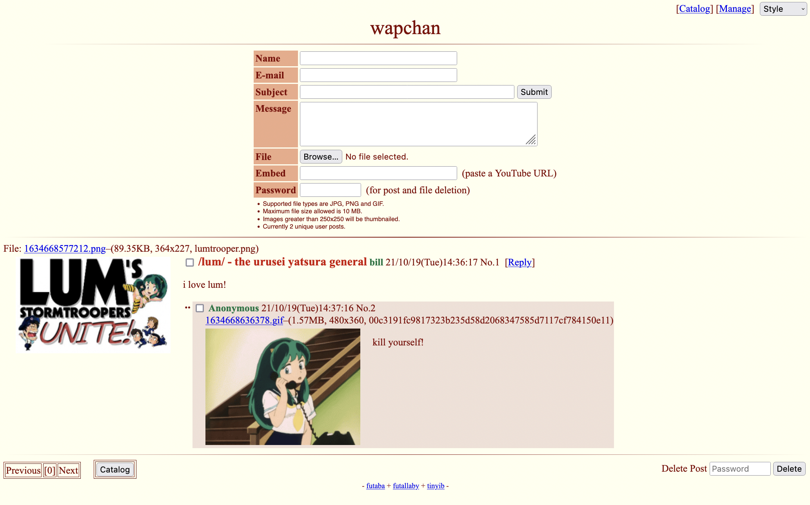

On the previous (Lynxchan) form of wapchan, the about page contained a writeup I did in late 2022 about the early history of the site. I have preserved it here for posterity, complete with spelling and grammar mistakes. The original file can still be viewed on [github](https://raw.githubusercontent.com/figamin/WapLynx-Neo/refs/heads/master/static/pages/about.html).

Wapchan's **F**requently **A**sked **Q**uestions:
=================================================

### Last updated on 11/13/22

｢what is wapchan?｣

Wapchan is retro content imageboard consisting of mutliple different boards covering various topics, where we strive to make a place not unlike the forums of old.

｢what does the name mean?｣

The name "Wapchan" was inspired by the term "wapanese" that used to be common on the internet in the early 2000s that meant "white japanese", or someone obsessed with japanese culture, which eventually fell out of use and was replaced by "weaboo" due to a 4chan word filter. Since wapchan focuses on the older aspects of anime, it's a fitting name. Also, I didn't come up with it, as that honor goes to [this](https://desuarchive.org/a/thread/229564359/#229604844") anon.

｢why are there so few boards?｣

Wapchan is meant to be a more focused imageboard than say 4chan or other all encompassing imageboards. Popular suggestions will most likely be added provided they fit the theme of the site.

A brief history of Wapchan:
===========================

｢the lum connection｣

Wapchan's roots can be traced back to (what was in my opinion) the golden age of /lum/ on 4chan's /a/nime board. I used to post a lot there, first starting in November 2020, and became a regular ranposter. After the threads started to go downhill back in March of 2021, I started the weekly UY storytime a month later, but that ultimately got abandoned due to the new manga translation being too far behind at the time. A few elements that would later become a part of wapchan (cytube streams and an IRC server) got their start there, and is part of the reason this site has a strong connection to Urusei Yatsura

｢starting out｣

Wapchan itself was an idea I had after thinking about the decline of /lum/ and how much better it could be if there was a site that actually moderated the threads and wasn't beholden to 4chan's secretdiscord cabal. However, I knew that UY couldn't carry a site alone like it could 20 years ago, and since I was interested in other retro anime, the idea became focused around /ar/ - the nonexistant retro anime board. Back in October of 2021 I first started discussing this idea in one of the many pre 2000s threads on /a/, and while the idea stalled out for a while (the site was originally going to use tinyIB as shown in this (following)  image, but I found that far too limiting), it eventually picked up steam, and was put together around the same time I also made a really dumb collage for /a/, with Wapchan officially going up on New Years 2022. The earliest archived version of Wapchan can be found [here](https://web.archive.org/web/20220112234023/http://wapchan.org/), in case you ever wondered how the site looked early on.

｢the first year｣

Since then, Wapchan has grown steadily, and while the site has always been pretty slow, it has still managed to forge a nice little community, with seven boards covering different topics. Hopefully it will continue to grow!